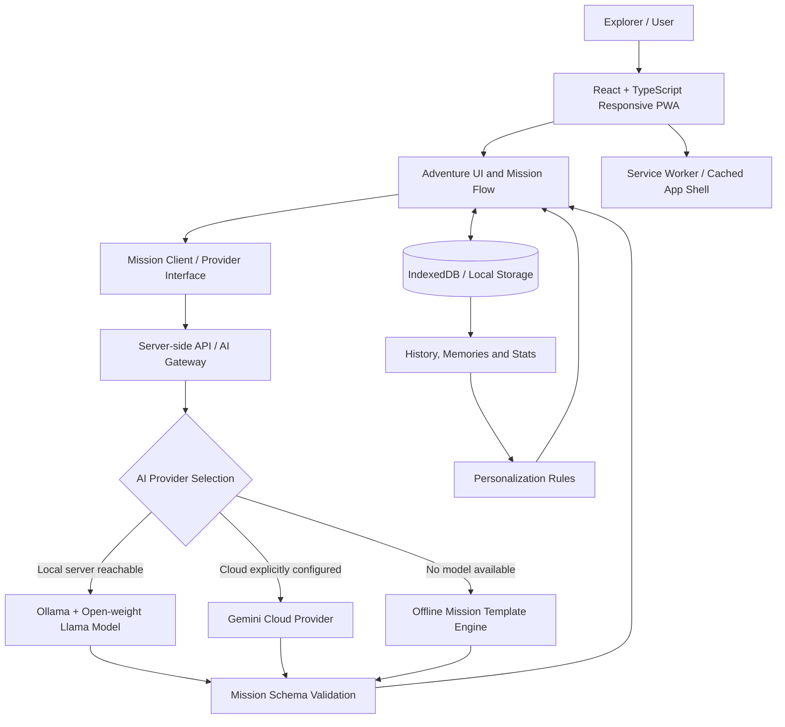
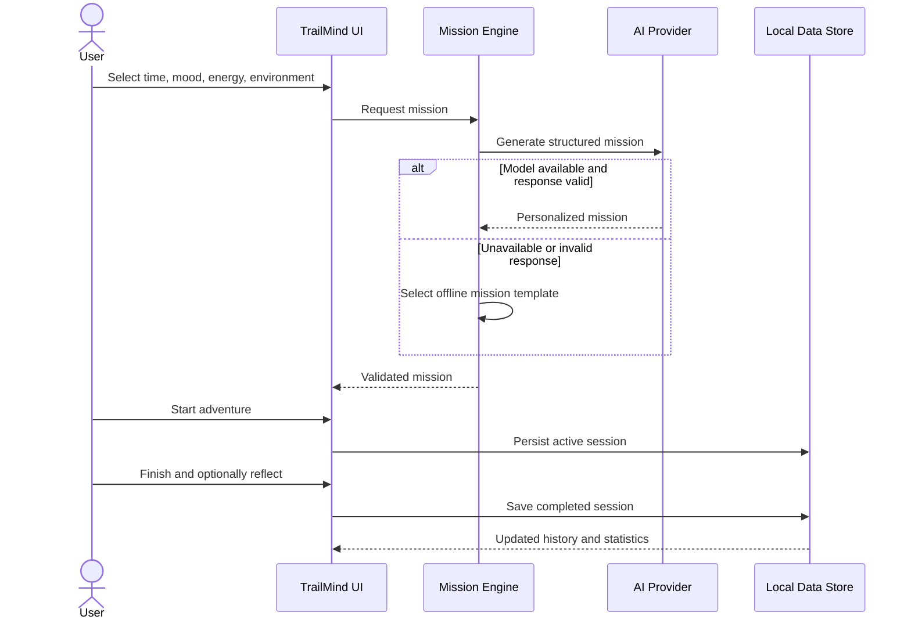

<div align="center">

# 🌿 TrailMind AI

### The AI That Wants You to Stop Using AI

**Less Screen. More World.**

An offline-first, open-model-ready outdoor adventure companion that turns a minute of AI assistance into real-world exploration.

[](https://react.dev/) [](https://www.typescriptlang.org/) [](https://ollama.com/) [](https://web.dev/learn/pwa)

**Built for the DEV Community Open Source AI Challenge — Touch Grass**

</div>

> **Project status:** The public repository currently contains a starter README only. This document describes the intended architecture and features developed/planned in Google AI Studio. Verify each capability against the exported source before marking it complete.

## 🌍 Overview

TrailMind AI is designed around one unusual product metric: **less time in the app, more time outdoors**. Users choose how much time they have, their mood, energy, environment, and preferred activity. TrailMind then proposes a short outdoor mission, helps them start, and gets out of the way. Afterward, they can record a reflection, save a memory, and see their real activity history.

**Example:** A user with 20 minutes, medium energy, and a nearby park might receive *The Five Colors Walk*: spot five colors in nature, notice one unexpected detail, and return with a short reflection.

## ✨ Core Experience

1. **Discover** — Choose time, mood, energy, environment, and activity.
2. **Generate** — Receive a personalized, safety-conscious outdoor mission.
3. **Go** — Start a distraction-free adventure with a timer and optional checklist.
4. **Reflect** — Rate the experience and optionally save notes or a photo.
5. **Grow** — Review genuine history, memories, and statistics; adapt future suggestions.

### Feature Scope

| Capability | Intended behavior |
|---|---|
| Immersive interface | Responsive, cinematic illustrated nature scenes with parallax depth |
| Personalized missions | AI-generated missions based on user selections and preferences |
| Open-model inference | Optional local Llama 3.2 inference through Ollama |
| Cloud provider | Optional Gemini integration when configured |
| Offline fallback | Built-in mission templates when no model is reachable |
| Distraction-free mode | Minimal timer, mission checklist, and “Phone Down. Adventure On.” message |
| Adventure journal | Save real completions, reflections, and memories |
| Personalization | Adapt recommendations using actual preferences and completed activities |
| Local-first storage | Preserve guest preferences and active sessions across refreshes |
| PWA | Installable experience with cached content where supported |

## 🏗️ System Architecture (Target Design)



**Important deployment boundary:** A remotely hosted server cannot access Ollama running at `127.0.0.1:11434` on a visitor's laptop. Local Ollama integration requires a locally running backend/bridge, an appropriate desktop deployment, or another explicitly configured accessible inference endpoint. The browser should not assume that a remote API can reach a user's localhost.

### AI Mission Generation Flow



## 🧠 Why Open-Weight AI?

Outdoor experiences should not depend on a reliable connection to a proprietary service. With a local model such as **Llama 3.2 through Ollama**, the mission-generation path can operate on hardware the user controls, without sending mission prompts to a third-party model API. The model can be replaced, the prompt can be customized, and local inference does not incur per-request cloud-model charges (though it uses the user's hardware and electricity).

**Three distinct operating modes:**

- **Local model mode:** Ollama serves an open-weight model on the same machine or an accessible local host. Local inference is only available when the runtime and model are actually installed and reachable.
- **Cloud mode:** An explicitly configured Gemini provider can generate missions when internet access and credentials are available.
- **Offline template mode:** Curated missions can be selected without an LLM or network connection. **This is a fallback, not open-weight inference.**

The goal is to make the **open model a working core option**, not merely a label on a cloud-only app.

## 🧩 Technology Stack

| Layer | Technology / approach |
|---|---|
| Frontend | React, TypeScript, responsive CSS |
| Visual experience | Illustrated 2.5D scenery, parallax, accessible interactions |
| AI abstraction | Provider interface and structured mission schema |
| Local model | Ollama with `llama3.2:3b` (when integrated) |
| Optional cloud model | Gemini API (when configured) |
| Offline missions | Local curated mission template engine |
| Guest persistence | IndexedDB and/or localStorage |
| Offline app delivery | PWA manifest and service worker |
| Deployment | Static/web hosting for UI; separate appropriate inference runtime |

> Exact framework packages, server runtime, and scripts must be confirmed after the AI Studio code is exported. Do not assume FastAPI or a specific database exists unless it appears in the source.

## 📁 Suggested Project Organization

```text
TrailMind-AI/
├── src/
│   ├── components/         # Reusable UI
│   ├── pages/              # Landing, Explore, Mission, History, etc.
│   ├── services/
│   │   ├── ai/             # Provider interfaces and adapters
│   │   ├── missions/       # Mission generation and validation
│   │   └── storage/        # Local persistence
│   ├── hooks/
│   ├── types/
│   └── assets/
├── public/                 # PWA assets and static media
├── server/                 # Optional secure server-side AI gateway
├── docs/                   # Architecture and deployment notes
├── .env.example
├── .gitignore
├── package.json
└── README.md
```

*Illustrative structure; align this section with the real exported file tree.*

## 🚀 Getting Started

### Prerequisites

- Node.js and npm compatible with the generated project's `package.json`
- Git
- Optional: [Ollama](https://ollama.com/) for local open-model inference

### 1. Clone the repository

```bash
git clone https://github.com/SOUMYADEEPDEY1217/TrailMind-AI.git
cd TrailMind-AI
```

### 2. Add the application source

The current public repository does not yet contain the generated application. Export or sync the code from Google AI Studio into this repository first. Once `package.json` exists, install dependencies:

```bash
npm install
```

### 3. Configure environment variables

Create a local environment file according to the exported app's `.env.example`. Keep API credentials on the server side; do not commit `.env` files. A local Ollama gateway may use:

```dotenv
OLLAMA_BASE_URL=http://127.0.0.1:11434
OLLAMA_MODEL=llama3.2:3b
```

These are **example server-side settings**. Actual variable names and start commands depend on the generated code.

### 4. Optional: Start the local model

```bash
ollama pull llama3.2:3b
ollama serve
```

If Ollama is already running as a background service, a second `ollama serve` process is unnecessary. Test it with:

```bash
ollama run llama3.2:3b
```

### 5. Run the app

After exporting the code, inspect `package.json` for the correct scripts. A typical Vite app uses:

```bash
npm run dev
```

If the project has a separate backend, start it according to its own README or package scripts. **A working frontend does not by itself confirm that local Ollama inference is connected.**

## 🔒 Privacy and Safety

TrailMind aims to minimize collection and keep guest activity records local where practical. Location should be optional; users should be able to select an environment manually. Local inference can avoid sending mission prompts to a cloud model, but using cloud mode changes that privacy boundary.

Mission suggestions should avoid trespassing, dangerous terrain, unsafe weather, and invented nearby landmarks. TrailMind is not a navigation or emergency-response service. Users remain responsible for checking real conditions and staying on safe, permitted routes.

## 🧪 Verification Checklist

- [ ] Source code exported and committed
- [ ] Production frontend build passes
- [ ] Responsive layout checked on mobile, tablet, and desktop
- [ ] Mission generated from real selections
- [ ] Ollama mission generated locally with cloud disconnected
- [ ] Offline template fallback tested with Ollama stopped
- [ ] Active mission survives refresh
- [ ] Completed adventure updates history and statistics
- [ ] No dummy personal history or fabricated metrics
- [ ] PWA active mission works without network
- [ ] No API keys or private `.env` files committed
- [ ] Real-world outdoor test documented with screenshots/video

## 🏆 Touch Grass Challenge

The premise is simple: **most software tries to keep you engaged; TrailMind tries to help you leave.**

A strong demo shows a real local open-weight model generating a mission, a person stepping outside, an offline-capable mission screen, and a genuine reflection afterward. This demonstrates not only an AI integration, but a product design where AI enables offline life rather than replacing it.

## 🛣️ Roadmap

- [ ] Verify and document working Ollama integration
- [ ] Complete robust offline PWA testing
- [ ] Add optional accessible activity modes
- [ ] Add community-contributed mission packs
- [ ] Support additional open-weight models
- [ ] Publish demo video and screenshots

## 🤝 Contributing

Issues and pull requests are welcome. Suggested contributions include safer mission templates, accessibility improvements, localization, performance enhancements, and open-model adapters. Please avoid submitting changes that expose credentials or introduce unnecessary collection of location data.

## 👨‍💻 Author

**Soumyadeep Dey**  
GitHub: [@SOUMYADEEPDEY1217](https://github.com/SOUMYADEEPDEY1217)

## 📄 License

Add a `LICENSE` file before declaring a specific open-source license. An MIT license is a reasonable option if that is the license you intend to grant.

---

<div align="center">

**Use AI for a minute. Experience the real world for the next hour.** 🌿

</div>
